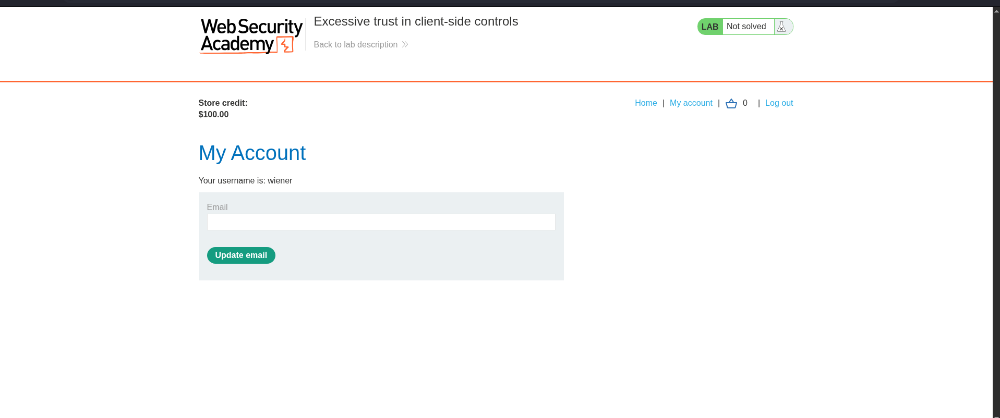
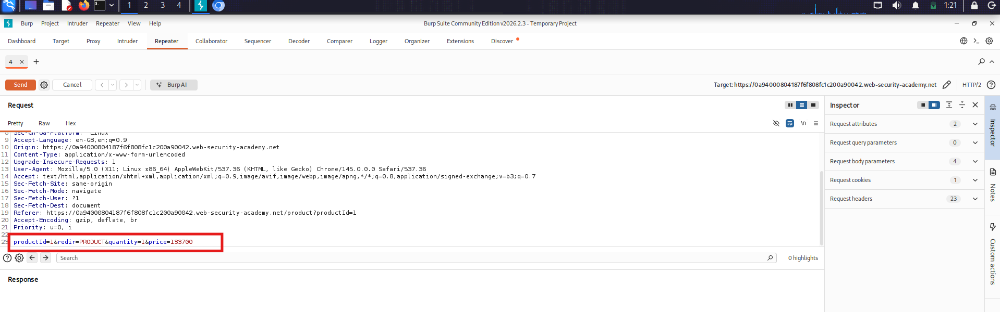
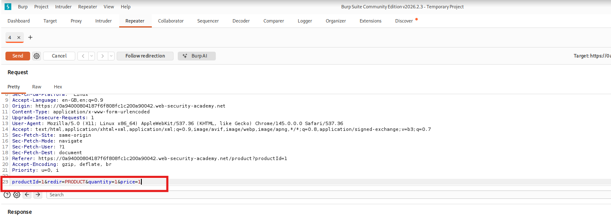
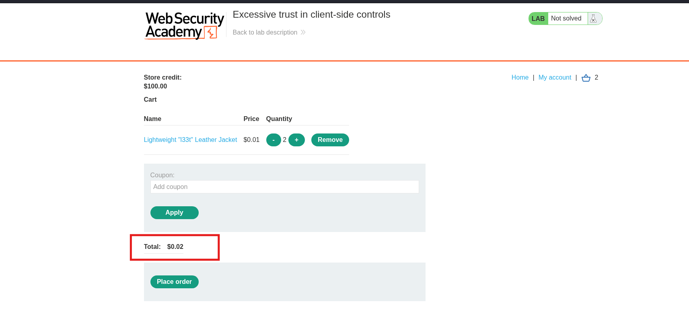
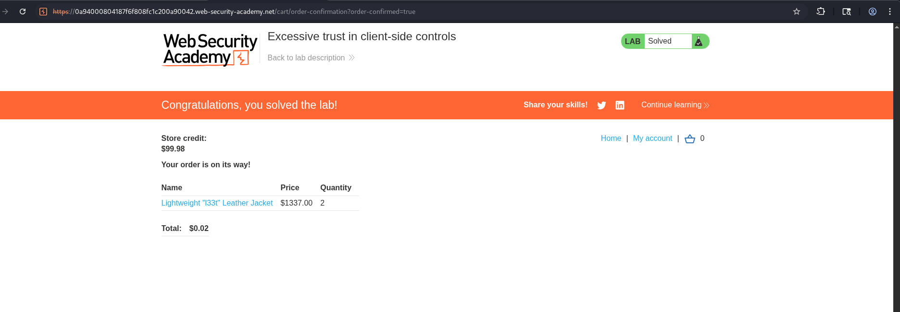

# Lab 01 — Excessive Trust in Client-Side Controls

| Field | Details |
|-------|---------|
| **Category** | Business Logic Vulnerabilities |
| **Difficulty** | 🟢 Apprentice |
| **Status** | ✅ Solved |

---

## 🎯 Objective

Purchase the **Lightweight l33t leather jacket** for $0.00 by
manipulating the price parameter that the server blindly trusts.

---

## 🐛 Vulnerability

The product price is sent as a parameter in the POST request when
adding an item to the cart. The server does not validate this value
against the real price in the database — it uses whatever the
client sends.

---

## 🛠️ Tools Used

- Burp Suite (Proxy + Repeater)
- Browser

---

## 🔢 Steps

### Step 1 — Log in

Log in with credentials: `wiener` / `peter`


---

### Step 2 — Add jacket to cart and intercept

Turn on Burp intercept, click **Add to cart** on the leather jacket.
The raw request will look like this:

    POST /cart HTTP/2
    productId=1&redir=PRODUCT&quantity=1&price=133700



---

### Step 3 — Modify the price

In the Burp intercept panel, change the price value:

    price=133700  →  price=1




---

### Step 4 — Forward and check cart

Click **Forward** in Burp. The cart now shows the manipulated price.


---

### Step 5 — Place the order

Click **Place order**. The lab solved banner appears.



---

## 📸 Screenshots Reference

| File | What it shows |
|------|---------------|
| `01-login.png` | Login page with wiener/peter filled in |
| `02-intercept-request.png` | Burp showing original price=133700 |
| `03-modified-price.png` | Burp with price=1 highlighted in red |
| `04-cart-modified-price.png` | Cart showing $0.01 price |
| `05-lab-solved.png` | Green solved banner |

---

## 🔍 Request Comparison

| Parameter | Original | Modified |
|-----------|----------|----------|
| `price` | `133700` ($1337.00) | `1` ($0.01) |
| `productId` | `1` | `1` unchanged |
| `quantity` | `1` | `1` unchanged |

---

## 🏁 Key Takeaway

> Never trust client-supplied values for security-sensitive fields.
> Price, discount, and role must always be validated server-side
> against a trusted database — never from the client request.

---

## 🛡️ Remediation

- Never include price in the client request
- Look up price using productId server-side only
- Reject zero, negative, or unexpected numeric values

---

## 🔗 References

- [PortSwigger: Business Logic Vulnerabilities](https://portswigger.net/web-security/logic-flaws)
- [OWASP: Client Side Controls](https://owasp.org/www-project-web-security-testing-guide/)
```

