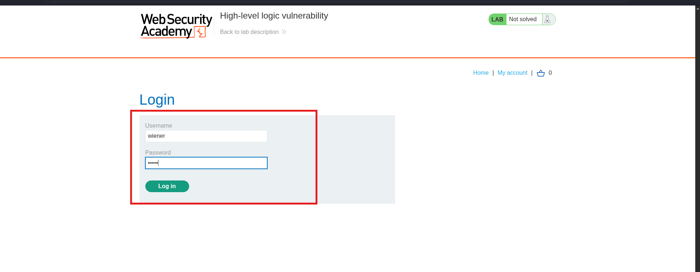
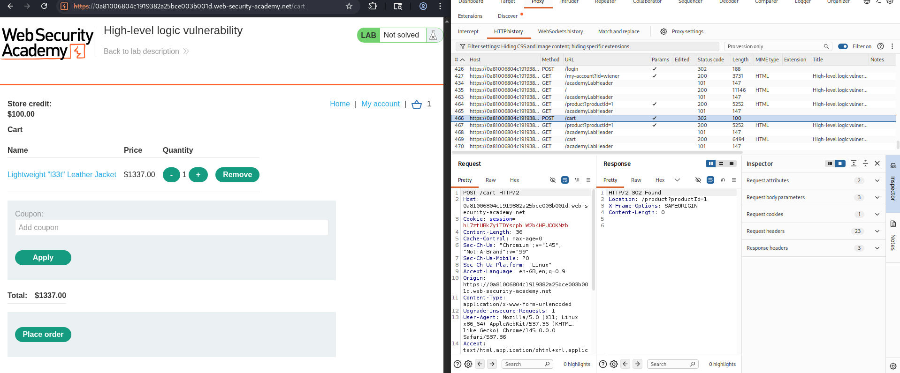
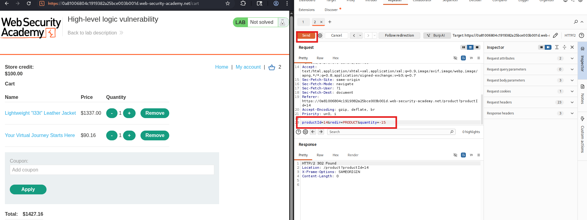
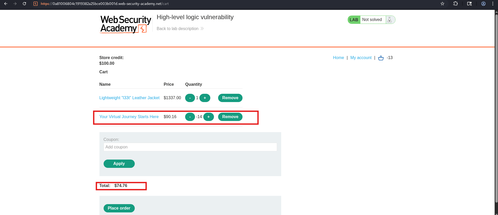
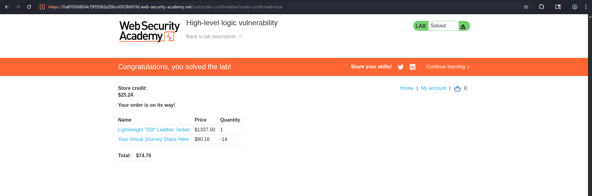

# Lab 02 — High-Level Logic Vulnerability

| Field | Details |
|-------|---------|
| **Category** | Business Logic Vulnerabilities |
| **Difficulty** | 🟢 Apprentice |
| **Status** | ✅ Solved |

---

## 🎯 Objective

Buy the **Lightweight l33t leather jacket** for a drastically reduced
price by sending a negative quantity in the add-to-cart request.

---

## 🐛 Vulnerability

The application checks that users cannot add zero items, but fails
to block **negative quantities**. Adding a negative quantity of a
cheap item reduces the overall cart total, allowing an expensive
item to be purchased for free or near free.

---

## 🛠️ Tools Used

- Burp Suite (Proxy + Repeater)
- Browser

---

## 🔢 Steps

### Step 1 — Log in

Log in with credentials: `wiener` / `peter`




---

### Step 2 — Add the leather jacket to cart

Add the leather jacket normally and intercept the request in Burp.



---

### Step 3 — Add a cheap item with negative quantity

Add any cheap item (e.g. the cheapest product in the store) and
intercept the request. Change the `quantity` parameter to a
negative number:

    quantity=1  →  quantity=-100

Forward the request.



---

### Step 4 — Check the cart total

Go to your cart. The negative quantity item has reduced the total
enough to be within your $100 store credit.



---

### Step 5 — Place the order

Click **Place order**. Lab solved!



---

## 📸 Screenshots Reference

| File | What it shows |
|------|---------------|
| `01-login.png` | Login page with wiener/peter filled in |
| `02-add-jacket.png` | Burp intercept of adding the jacket |
| `03-negative-quantity.png` | Burp with quantity=-100 highlighted |
| `04-cart-total.png` | Cart showing reduced/affordable total |
| `05-lab-solved.png` | Green solved banner |

---

## 🔍 Request Comparison

| Parameter | Original | Modified |
|-----------|----------|----------|
| `quantity` | `1` | `-100` |
| `productId` | `2` | `2` unchanged |

---

## 🏁 Key Takeaway

> Always validate that quantities are **positive integers only**.
> Reject zero, negative, and non-integer values on the server —
> never rely on client-side validation alone.

---

## 🛡️ Remediation

- Enforce `quantity >= 1` server-side on every add-to-cart request
- Validate that the cart total never goes below $0.00 before checkout
- Reject any order where line item totals are negative

---

## 🔗 References

- [PortSwigger: Business Logic Vulnerabilities](https://portswigger.net/web-security/logic-flaws)
```
