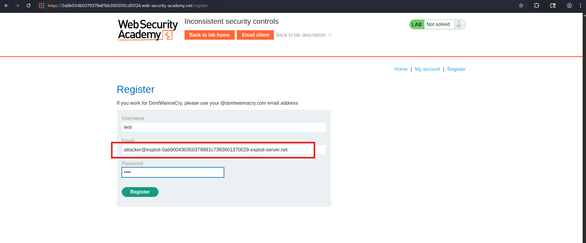
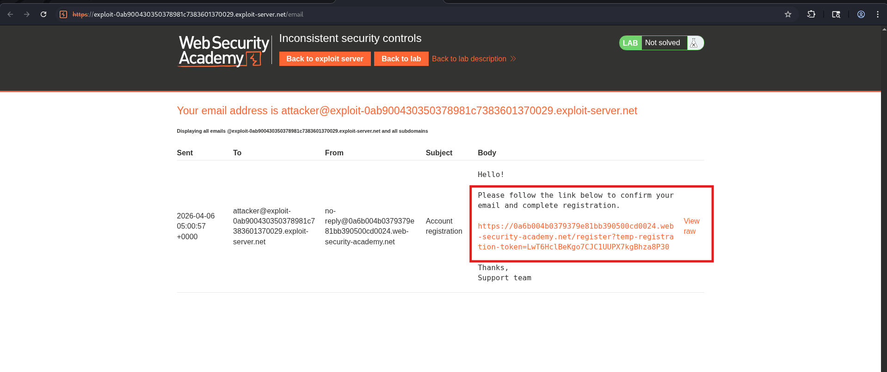
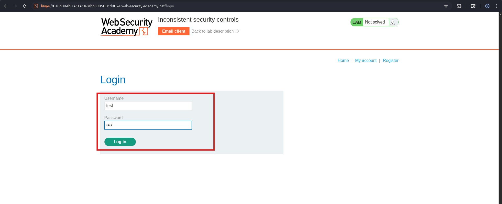
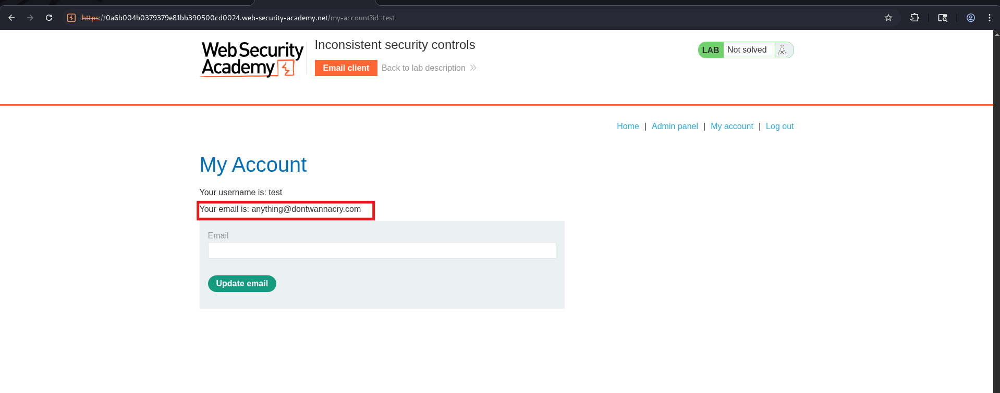
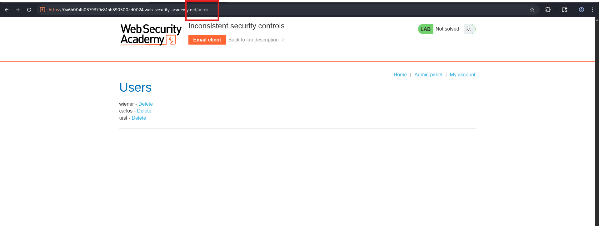
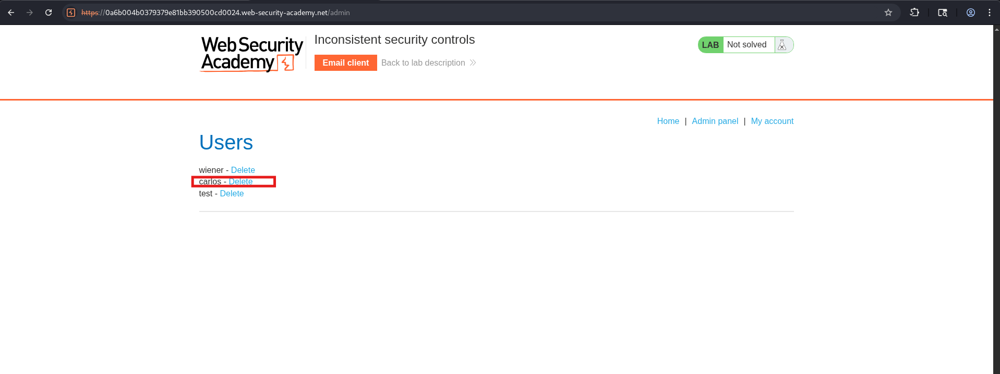
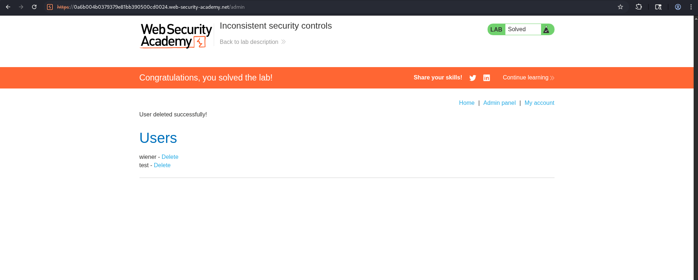

# Lab 03 — Inconsistent Security Controls

| Field | Details |
|-------|---------|
| **Category** | Business Logic Vulnerabilities |
| **Difficulty** | 🟢 Apprentice |
| **Status** | ✅ Solved |

---

## 🎯 Objective

Access the **admin panel** and delete the user `carlos` by registering
with a manipulated email that bypasses the domain-based access control.

---

## 🐛 Vulnerability

The admin panel is restricted to users with a `@dontwannacry.com`
email address. However, the application allows users to **change
their email after registration** without verifying ownership of the
new email. This means anyone can register normally and then update
their email to any `@dontwannacry.com` address to gain admin access.

---

## 🛠️ Tools Used

- Burp Suite (Proxy)
- Browser

---

## 🔢 Steps

### Step 1 — Register a new account

Go to the registration page and sign up with your email client
provided by the lab (check the **Email client** button on the lab page).



---

### Step 2 — Confirm registration via email

Open the email client provided in the lab, find the confirmation
email and click the confirmation link.



---

### Step 3 — Log in with your new account

Log in using the credentials you just registered.



---

### Step 4 — Change email to @dontwannacry.com

Go to **My Account** and change your email to:

    anything@dontwannacry.com

Click **Update email** — no verification is required.



---

### Step 5 — Access the admin panel

Navigate to `/admin` in the browser. You now have full admin access.



---

### Step 6 — Delete carlos

In the admin panel, find user `carlos` and click **Delete**.



---

### Step 7 — Lab solved



---

## 📸 Screenshots Reference

| File | What it shows |
|------|---------------|
| `01-register.png` | Registration page filled in |
| `02-email-confirm.png` | Lab email client with confirmation link |
| `03-login.png` | Login with new account |
| `04-change-email.png` | My Account with @dontwannacry.com email |
| `05-admin-panel.png` | /admin page now accessible |
| `06-delete-carlos.png` | Deleting carlos in admin panel |
| `07-lab-solved.png` | Green solved banner |

---

## 🔍 Key Observation

| Stage | Email Used | Admin Access |
|-------|-----------|--------------|
| Registration | `attacker@exploit.com` | ❌ No |
| After email change | `attacker@dontwannacry.com` | ✅ Yes |

---

## 🏁 Key Takeaway

> Email-based access control must verify **ownership at every
> change**, not just at registration. Allowing unverified email
> updates breaks the entire trust model of domain-based controls.

---

## 🛡️ Remediation

- Send a verification link to the **new email** before applying
  any email change
- Never grant access based solely on email domain without
  re-verifying ownership
- Audit existing users periodically for suspicious domain changes

---

## 🔗 References

- [PortSwigger: Business Logic Vulnerabilities](https://portswigger.net/web-security/logic-flaws)
```
