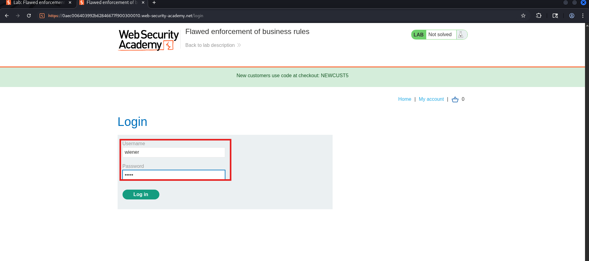
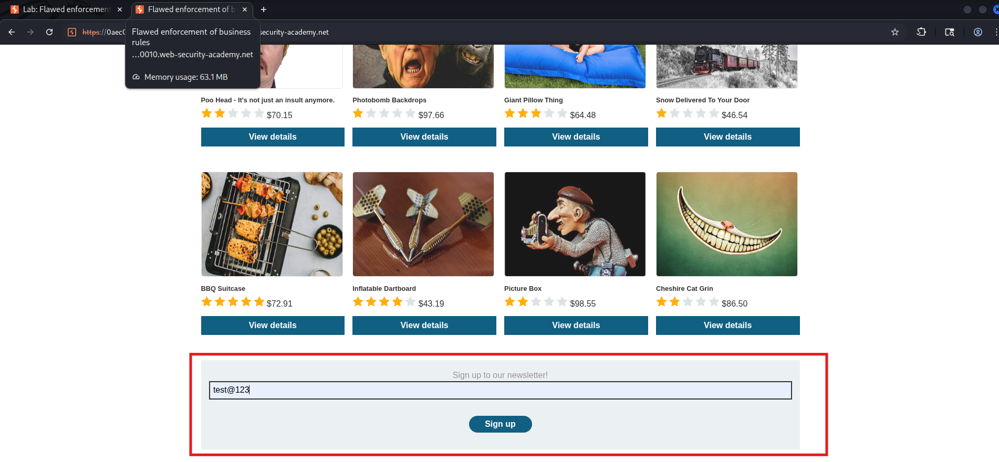
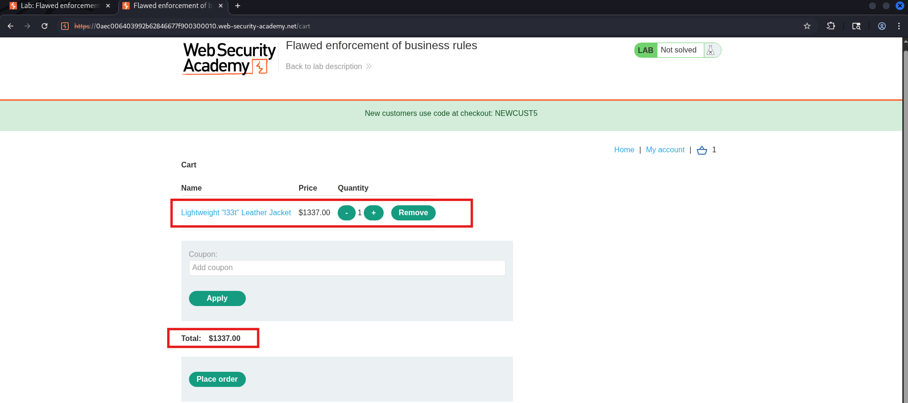
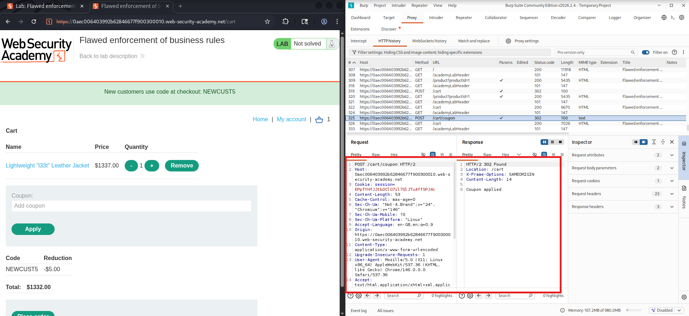
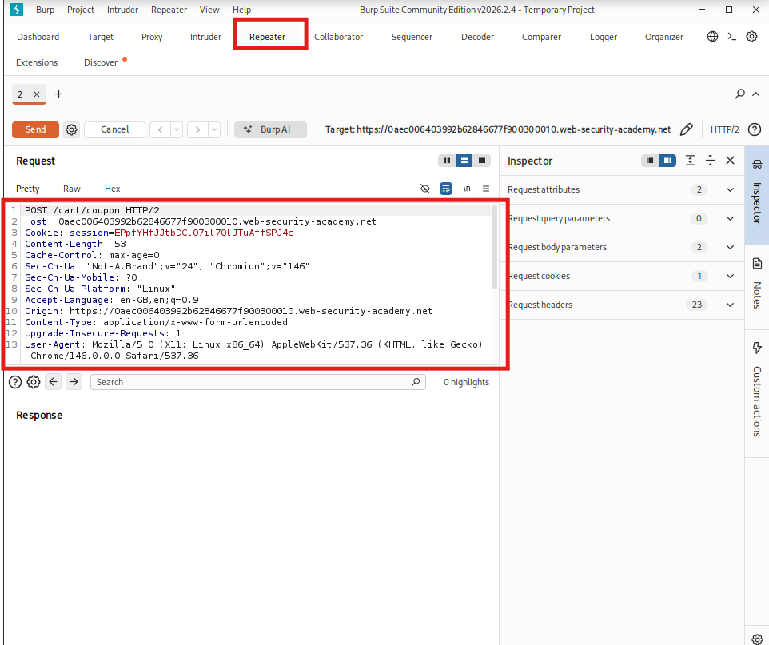
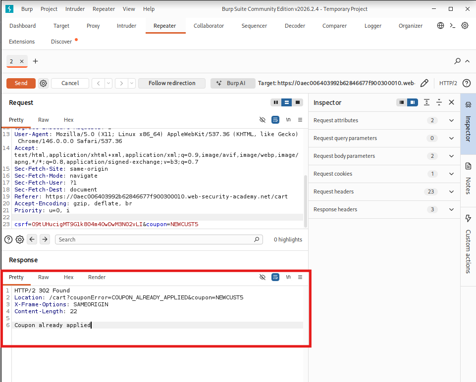
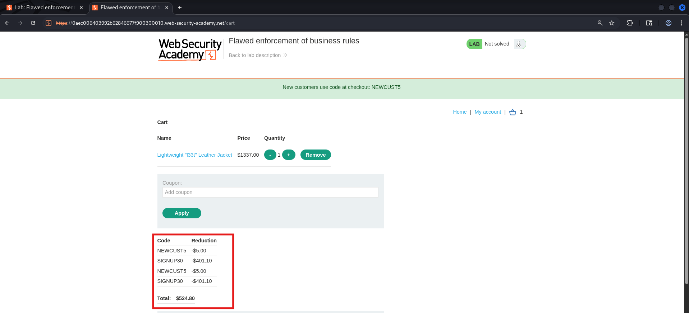
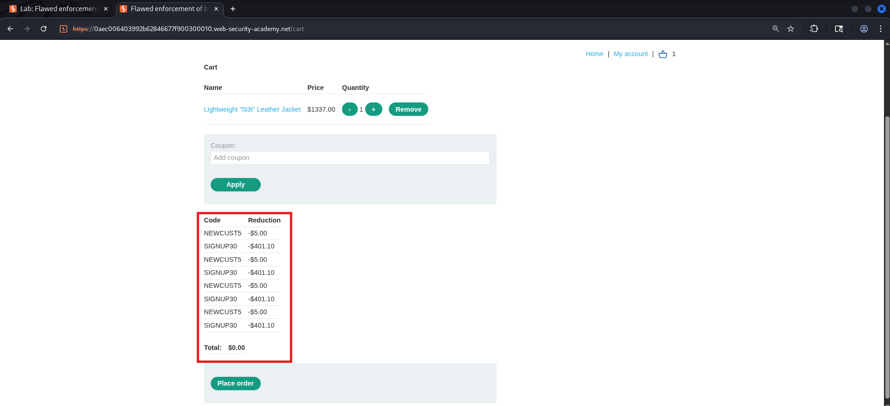
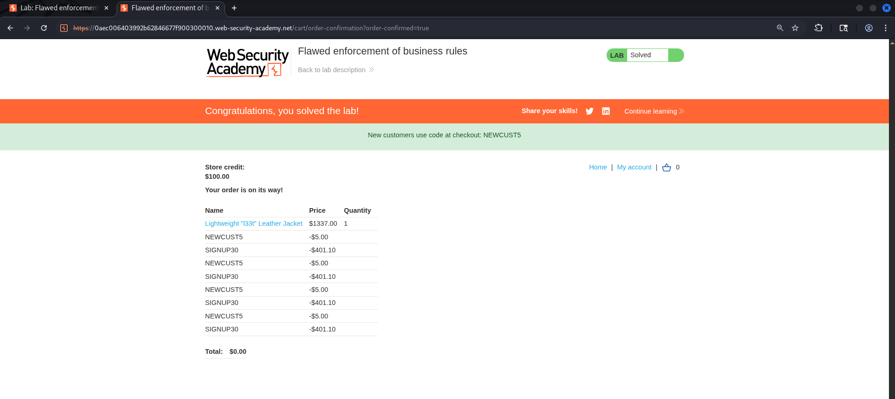

# Lab 04 — Flawed Enforcement of Business Rules

| Field | Details |
|-------|---------|
| **Category** | Business Logic Vulnerabilities |
| **Difficulty** | 🟢 Apprentice |
| **Status** | ✅ Solved |

---

## 🎯 Objective

Purchase the **Lightweight l33t leather jacket** by alternating
between two coupon codes to reduce the price below your
$100 store credit balance.

---

## 🐛 Vulnerability

The application prevents applying the **same coupon twice in a row**,
but does NOT track overall coupon usage per session. By intercepting
the coupon POST request in Burp and sending it to Repeater, we can
alternate between two codes unlimited times — driving the price to $0.

---

## 🛠️ Tools Used

- Burp Suite (Proxy + Repeater)
- Browser

---

## 🔢 Steps

### Step 1 — Log in

Log in with credentials: `wiener` / `peter`



---

### Step 2 — Sign up for the newsletter

Scroll to the bottom of the store and sign up for the newsletter.
This gives you the second coupon code `SIGNUP30`.



---

### Step 3 — Add leather jacket to cart

Add the leather jacket to your cart and go to the cart page.



---

### Step 4 — Intercept the coupon POST request

1. Turn on **Burp Intercept**
2. In the cart, enter coupon `NEWCUST5` and click **Apply**
3. Burp intercepts the POST request which looks like:
```
POST /cart/coupon HTTP/2
csrf=xxxx&coupon=NEWCUST5
```



---

### Step 5 — Send to Repeater

Right-click the intercepted request and click
**Send to Repeater**. Then click **Forward** to let
the original request through.



---

### Step 6 — Apply NEWCUST5 first

In Burp **Repeater**, the request body shows:

    csrf=xxxx&coupon=NEWCUST5

Click **Send** — you will see a 302 response confirming
the first coupon is applied.



---

### Step 7 — Change coupon to SIGNUP30 in Repeater

In the same Repeater tab, change the coupon parameter:

    coupon=NEWCUST5  →  coupon=SIGNUP30

Click **Send** — SIGNUP30 is now applied on top.


---

### Step 8 — Keep alternating in Repeater

Now alternate back and forth in Repeater:

    coupon=NEWCUST5 → Send
    coupon=SIGNUP30 → Send
    coupon=NEWCUST5 → Send
    coupon=SIGNUP30 → Send
    ...

Each time you switch and send, the discount stacks further.
Check the cart in the browser periodically to watch the
price drop.



---

### Step 9 — Verify cart total is within budget

Go back to the browser cart. The total should now be
within your $100 store credit.



---

### Step 10 — Place the order

Click **Place order**. Lab solved!



---

## 📸 Screenshots Reference

| File | What it shows |
|------|---------------|
| `01-login.png` | Login page with wiener/peter |
| `02-newsletter-signup.png` | Newsletter signup at bottom of page |
| `03-jacket-in-cart.png` | Cart with jacket at full price |
| `04-intercept-coupon-request.png` | Burp intercept of coupon POST request |
| `05-send-to-repeater.png` | Right-click Send to Repeater in Burp |
| `06-newcust5-applied.png` | Repeater showing NEWCUST5 sent successfully |
| `07-signup30-applied.png` | Repeater with coupon changed to SIGNUP30 |
| `08-alternating-repeater.png` | Repeater mid-alternation showing price drop |
| `09-final-cart-price.png` | Cart total within $100 budget |
| `10-lab-solved.png` | Green solved banner |

---

## 🔍 How the Coupon Bypass Works in Repeater

| Repeater Send # | Coupon Sent | Cart Total (approx) |
|-----------------|------------|---------------------|
| 1 | NEWCUST5 | ~$1,270 |
| 2 | SIGNUP30 | ~$889 |
| 3 | NEWCUST5 | ~$845 |
| 4 | SIGNUP30 | ~$591 |
| 5 | NEWCUST5 | ~$562 |
| 6 | SIGNUP30 | ~$393 |
| ... | alternating | keeps dropping |
| Final | — | under $100 ✅ |

---

## 🏁 Key Takeaway

> Track **all coupons applied per session**, not just the last one.
> A coupon should be permanently marked as used after first
> application — alternating with other codes must not reset this.

---

## 🛡️ Remediation

- Store all applied coupon codes server-side per session and
  reject any code already used in that order
- Set a hard global limit of one use per coupon per account
- Validate the final order total server-side before processing

---

## 🔗 References

- [PortSwigger: Business Logic Vulnerabilities](https://portswigger.net/web-security/logic-flaws)
```
