# Lab 05 — Low-Level Logic Flaw

| Field | Details |
|-------|---------|
| **Category** | Business Logic Vulnerabilities |
| **Difficulty** | 🟡 Practitioner |
| **Status** | ✅ Solved |

---

## 🎯 Objective

Purchase the **Lightweight l33t leather jacket** by causing an
integer overflow in the cart total, making the price wrap around
to a large negative number.

---

## 🐛 Vulnerability

The server stores the cart total as a signed 32-bit integer
(max value: 2,147,483,647). By repeatedly adding large quantities
of the jacket using Burp Intruder, the total exceeds this maximum
and **overflows** — wrapping around to a large negative number.
We then add small cheap items to bring the total into the
$0–$100 range to place the order.

---

## 🛠️ Tools Used

- Burp Suite (Proxy + Intruder + Repeater)
- Browser

---

## 🔢 Steps

### Step 1 — Log in

Log in with credentials: `wiener` / `peter`

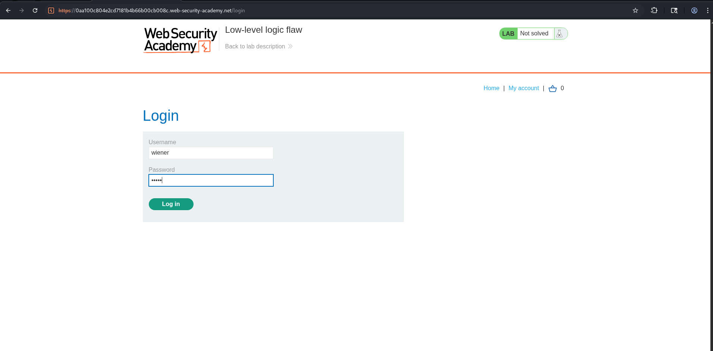

---

### Step 2 — Add leather jacket to cart and intercept

Turn on **Burp Intercept**, add the leather jacket to cart.
The intercepted POST request looks like:
```
POST /cart HTTP/2
productId=1&redir=PRODUCT&quantity=1
```

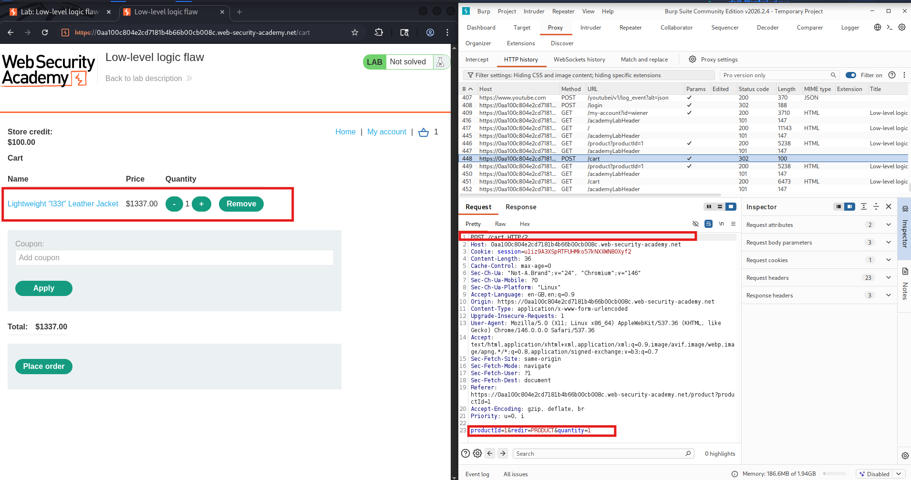

---

### Step 3 — Send to Intruder

Right-click the intercepted request and click
**Send to Intruder**. Then **Forward** the original request.

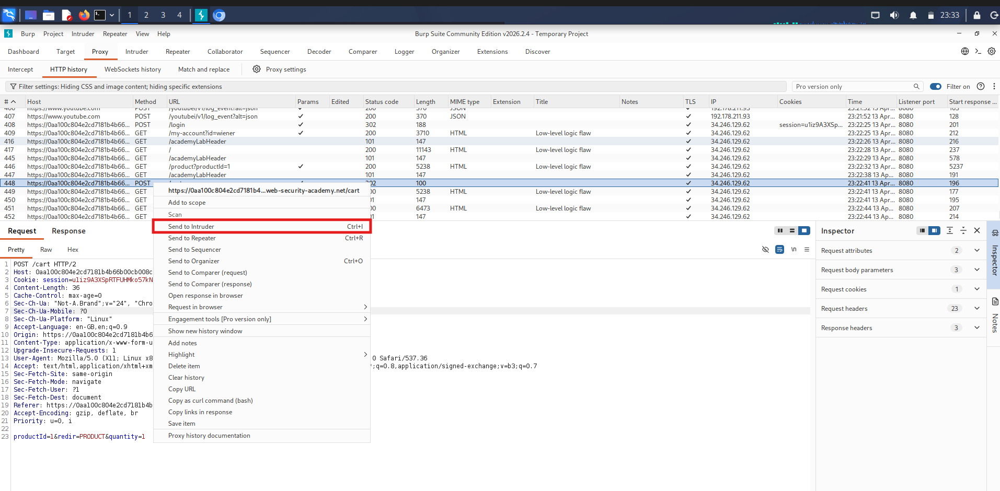

---

### Step 4 — Configure Intruder

In Burp **Intruder**:

1. Go to **Positions** tab
2. Click **Clear §** to remove all auto-selected positions
3. Highlight the quantity value `1` and click **Add §**

The request should look like:
```
productId=1&redir=PRODUCT&quantity=§1§
```

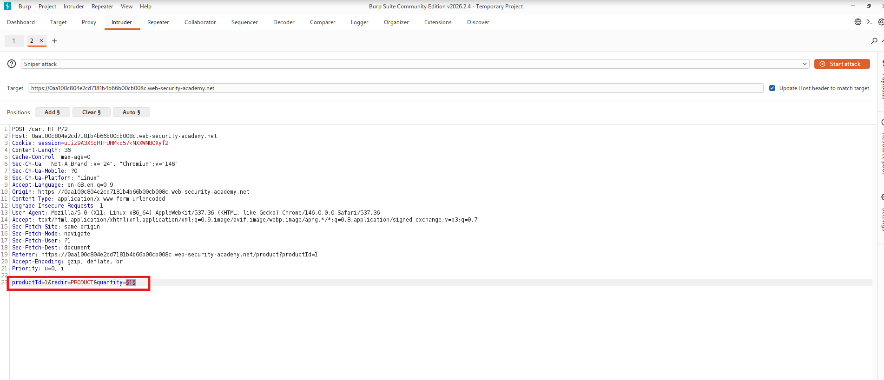

---

### Step 5 — Set Intruder payload to Null payloads

1. Go to **Payloads** tab
2. Set **Payload type** to `Null payloads`
3. Select **Continue indefinitely**
4. Go to **Settings** tab → set **Max concurrent requests** to `1`

> This will keep sending the request repeatedly, adding
> the jacket to cart each time with quantity=1 but very fast.

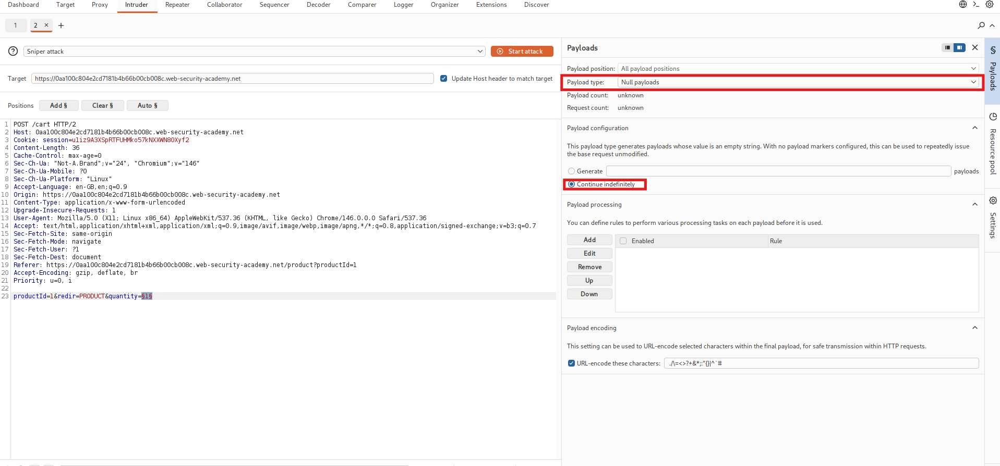

---

### Step 6 — Change quantity to 99 in Positions

Go back to **Positions** tab and manually change
quantity value from `1` to `99` inside the markers:
```
productId=1&redir=PRODUCT&quantity=§99§
```

This adds 99 jackets per request, causing overflow much faster.

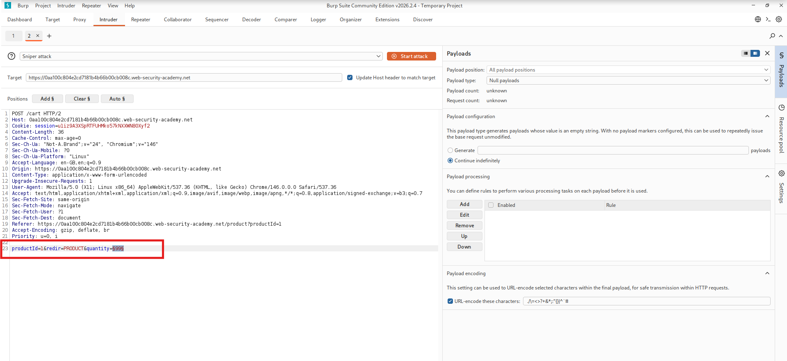

---

### Step 7 — Start the attack

Click **Start attack**. Watch the cart total in the browser.
Keep checking the cart periodically while Intruder runs.

The total will climb rapidly:

    $1,337 → $133,700 → $1,337,000 → ... → $2,147,483,647 → OVERFLOW → large negative number

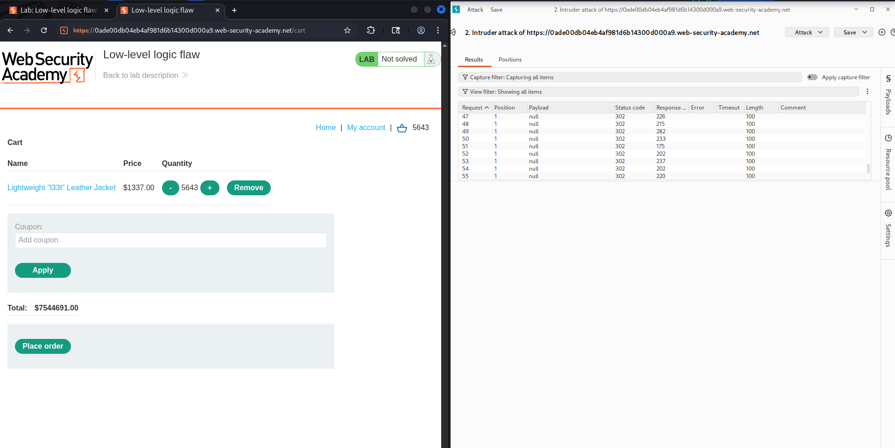

---

### Step 8 — Stop Intruder when total goes negative

As soon as you see the cart total become a **large negative
number** (e.g. -$2,147,351,948), stop the Intruder attack
immediately.

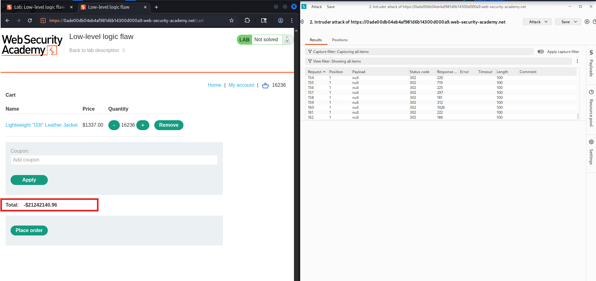

---

### Step 9 — Add cheap items to bring total to $0–$100

Now use Burp **Repeater** to add a cheap item
(e.g. `productId=2`, the cheapest product) in small
quantities to nudge the total up into the $0–$100 range.

Send this request repeatedly in Repeater, adjusting quantity:
```
POST /cart HTTP/2
productId=2&redir=PRODUCT&quantity=1
```

Check the cart in the browser after each send until the
total lands between $0 and $100.

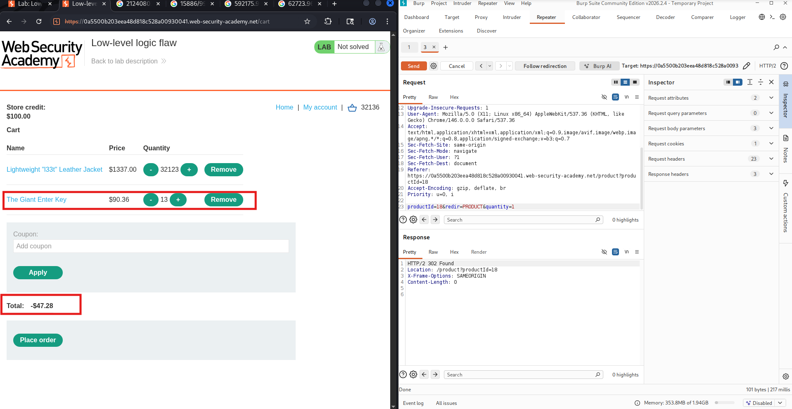

---

### Step 10 — Verify final cart total

Go to cart — total should now be between $0 and $100,
within your store credit.

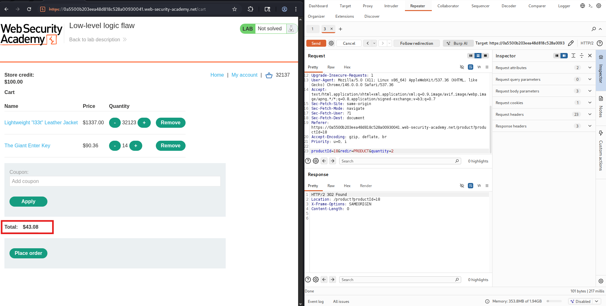

---

### Step 11 — Place the order

Click **Place order**. Lab solved!

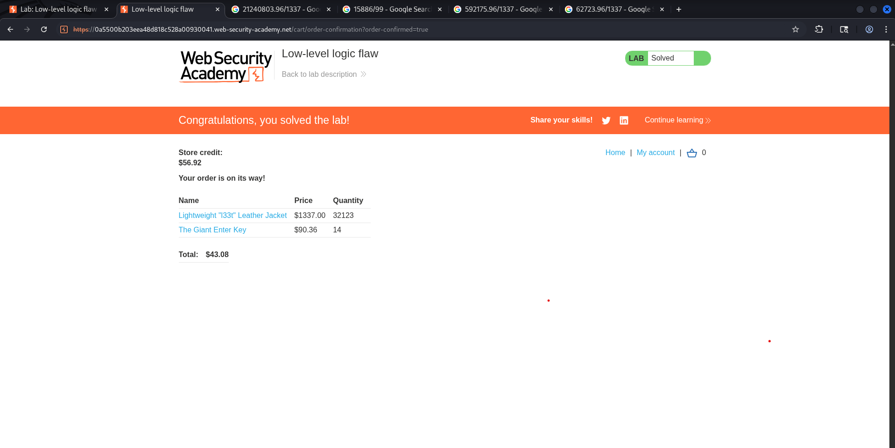

---

## 📸 Screenshots Reference

| File | What it shows |
|------|---------------|
| `01-login.png` | Login page with wiener/peter |
| `02-intercept-add-to-cart.png` | Burp intercept of add to cart POST |
| `03-send-to-intruder.png` | Right-click Send to Intruder |
| `04-intruder-positions.png` | Intruder Positions tab with quantity marked |
| `05-intruder-null-payload.png` | Payloads tab with Null payloads selected |
| `06-intruder-quantity-99.png` | Positions tab with quantity=99 |
| `07-intruder-running.png` | Intruder attack in progress |
| `08-cart-overflow-negative.png` | Cart showing large negative total |
| `09-repeater-adjust-total.png` | Repeater adding cheap items to adjust |
| `10-final-cart-total.png` | Cart total between $0–$100 |
| `11-lab-solved.png` | Green solved banner |

---

## 🔍 Integer Overflow Explained

| Stage | Cart Total |
|-------|-----------|
| Start | $1,337.00 |
| After many adds | $2,147,483,647 (max 32-bit int) |
| After one more add | overflows → large negative |
| After cheap item nudge | $0 – $100 ✅ |

The 32-bit signed integer max is **2,147,483,647**.
Any value above this wraps around to a negative number.

---

## 🏁 Key Takeaway

> Use safe numeric types for financial calculations.
> Always validate that cart totals stay within expected
> bounds — never allow negative totals to reach checkout.

---

## 🛡️ Remediation

- Use `BigDecimal` or 64-bit integers for all price calculations
- Set a server-side maximum quantity per item per order
- Reject any cart total that is zero or negative before checkout
- Cap the maximum possible order value server-side

---

## 🔗 References

- [PortSwigger: Business Logic Vulnerabilities](https://portswigger.net/web-security/logic-flaws)
- [OWASP: Integer Overflow](https://owasp.org/www-community/vulnerabilities/Integer_overflow)
```
